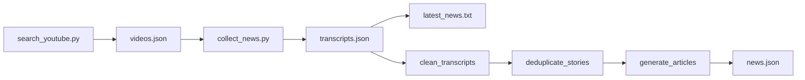

# YouTube Sagebot — Telugu YouTube News Collector

Standalone YouTube tools (search, transcripts, export, dedup, Groq articles).  
**MediaSphere dashboard integration** uses the separate package at [`../youtube/`](../youtube/) and `run_youtube_analysis.py`.

Collects Telugu news from YouTube videos for **Palnadu / Narasaraopet** constituency keywords.

## Features

- YouTube search by locality keywords (Telugu + English)
- Telugu transcript collection via `youtube-transcript-api`
- News filtering and text cleanup
- Embedding-based story deduplication
- Groq LLM article generation (optional)
- 4-hour auto-refresh scheduler

## Requirements

- Python 3.10+
- [YouTube Data API v3](https://console.cloud.google.com/) key
- [Groq API](https://console.groq.com/) key (only for article generation / `extract_news_content.py`)

## Installation

```bash
cd server/youtube-sagebot
python -m venv .venv

# Windows
.venv\Scripts\activate

# macOS / Linux
source .venv/bin/activate

pip install -r requirements.txt
```

Copy environment template and add your keys:

```bash
copy .env.example .env   # Windows
# cp .env.example .env   # macOS / Linux
```

Edit `.env`:

```
YOUTUBE_API_KEY=your_youtube_api_key
GROQ_API_KEY=your_groq_api_key
```

## Quick Start (collect + export)

```bash
python search_youtube.py --days 2
python collect_news.py
python export_latest_news.py
```

Output: `data/latest_news.txt`

## Full Pipeline

**Collect only** (search → transcripts → `latest_news.txt`):

```bash
python run_pipeline.py --days 2
```

**Full AI pipeline** (clean → deduplicate → articles → `news.json`):

```bash
python run_pipeline.py --days 2 --full --limit 10
```

## Continuous Refresh

Runs search + collect + export every 4 hours:

```bash
python auto_refresh.py
```

## Optional Scripts

| Command | Purpose |
|---------|---------|
| `python extract_news_content.py` | Dedup + Groq summaries → `data/extracted_news.txt` |
| `python combine_transcripts.py` | Merge all transcripts into one `.txt` |
| `python export_transcripts.py` | One `.txt` file per video |

## Pipeline Stages



## Data Files

All outputs live under `data/`:

| File | Description |
|------|-------------|
| `videos.json` | YouTube search results |
| `transcripts.json` | Fetched Telugu captions |
| `latest_news.txt` | Human-readable transcript export |
| `clean_transcripts.json` | Filtered news-only transcripts |
| `unique_stories.json` | Deduplicated story clusters |
| `articles.json` | Generated newspaper articles |
| `news.json` | Final structured news output |

## Configuration

Edit [`config.py`](config.py) for keywords, search window, and paths. API keys are loaded from `.env` only.

## Dependencies

See [`requirements.txt`](requirements.txt). Key packages:

- `google-api-python-client` — YouTube search
- `youtube-transcript-api` — caption fetch
- `sentence-transformers` + `torch` — deduplication embeddings
- `groq` — LLM article generation
- `python-dotenv` — environment configuration

On first deduplication run, the multilingual embedding model (~400 MB) is downloaded from Hugging Face.

## Troubleshooting

| Issue | Fix |
|-------|-----|
| `YOUTUBE_API_KEY is not set` | Create `.env` from `.env.example` |
| No Telugu transcripts | Video may lack Telugu captions |
| Groq rate limit (429) | Pipeline waits and retries; reduce `--limit` |
| Slow first dedup run | Model download; subsequent runs use cache |

## License

See repository license file if present.
